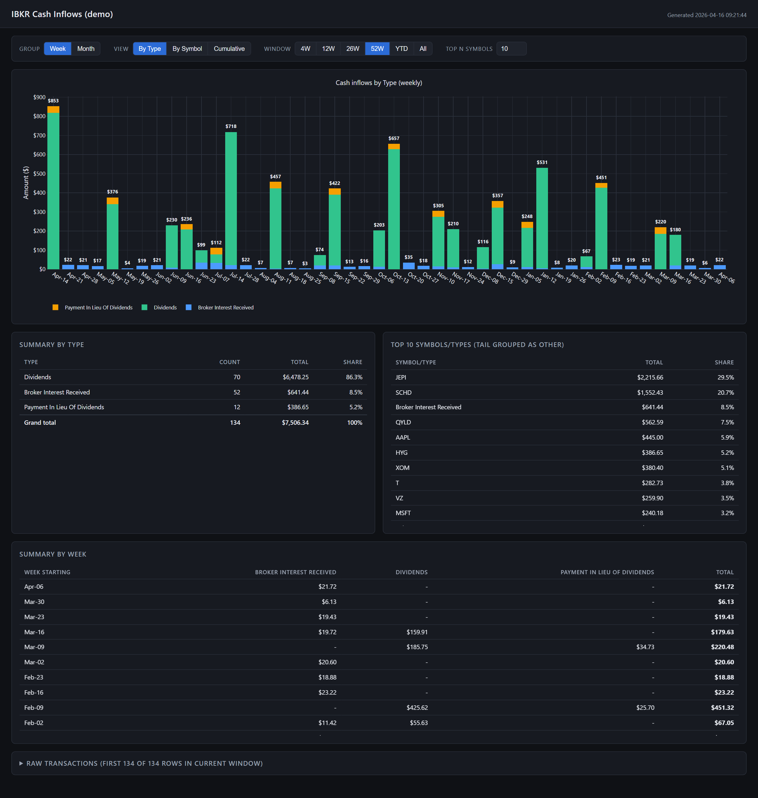

# IBKR Cash Inflow Tracker

A Python application that fetches cash inflow transactions (dividends, payments in lieu of dividends, broker interest) from Interactive Brokers (IBKR) via the WebFlex Query API and renders a consolidated, interactive dashboard in a single HTML file.



*Screenshot uses fabricated demo data; see [`screenshots/README.md`](screenshots/README.md) for how it's regenerated.*

## Features

- **Consolidated dashboard**: One `dashboard.html` with all views in a single window
- **Flexible grouping**: Toggle between Week and Month without rerunning the script
- **View modes**: Stacked bars by Type, stacked bars by Symbol (top N + Other), or a cumulative stacked-area chart
- **Adjustable window**: Preset buttons for 4W / 12W / 26W / 52W / YTD / All
- **Client-side interactivity**: All filtering happens in the browser via Plotly.js; no server needed
- **Caching**: Raw CSV + daily parsed Parquet cache for fast warm runs
- **Secure**: `.env`-based token management, nothing leaves your machine

## Prerequisites

- **IBKR Account** with WebFlex Query access enabled
- **Python 3.11+**
- **[uv](https://docs.astral.sh/uv/)** (recommended) or any standard venv + pip

## IBKR Setup Instructions

### Step 1: Enable WebFlex Query Access

1. **Log into IBKR Client Portal**: https://www.interactivebrokers.com/portal/
2. **Navigate to Reports**: Go to "Performance & Reports" → "Flex Queries"
3. **Enable WebFlex Service**: 
   - Click "Configure Flex Web Service"
   - Accept the terms and enable the service
   - Note down your **Flex Web Service Token** (you'll need this later)

### Step 2: Create Cash Transaction Query

1. **Create New Query**:
   - Click "Create" → "Activity Flex Query"
   - Name it: `Cash Transactions` (or your preferred name)

2. **Configure Query Sections**:
   - **Cash Report**: ✅ Enable
   - **Date Period**: Set to your preferred range (e.g., "Last 365 Days" or "Year to Date")

3. **Cash Report Configuration**:
   - **Include**: 
     - ✅ Dividends
     - ✅ Other Fees (optional)
     - ✅ Deposits/Withdrawals (optional)
   - **Columns to Include**:
     - ✅ Symbol
     - ✅ Description  
     - ✅ Date/Time
     - ✅ Settle Date
     - ✅ Amount
     - ✅ Currency
     - ✅ Type
     - ✅ Ex-Date
     - ✅ Report Date

4. **Save Query**:
   - Click "Save"
   - Note down the **Query ID** (appears in the query list)

### Step 3: Get Your Configuration Values

After completing the setup, you'll have these required values:

- **Flex Web Service Token**: From Step 1 (long alphanumeric string)
- **Cash Transactions Query ID**: From Step 2 (numeric ID)

## Installation

### 1. Clone Repository
```bash
git clone https://github.com/vagulans/dividend-tracker.git
cd dividend-tracker
```

### 2. Create Environment & Install Dependencies

Recommended (uv, single step):
```bash
uv sync
```
This creates `.venv/` with Python 3.11 and installs everything pinned in `uv.lock`.

Alternative (pip + venv):
```bash
python -m venv .venv
# Windows:
.venv\Scripts\activate
# Linux/Mac:
source .venv/bin/activate

pip install -e .
# or: pip install requests pandas python-dotenv plotly
```

### 4. Configure Environment Variables

Create a `.env` file in the project root:

```bash
# Copy the sample file
cp .env.sample .env
```

Edit `.env` with your IBKR credentials:
```env
# IBKR WebFlex Service Token (from IBKR Client Portal)
IBKR_TOKEN=your_flex_web_service_token_here

# Query ID for Cash Transactions (from your Flex Query)
FLEX_QUERY_ID_CASH_TRANSACTIONS=your_query_id_here
```

**Important**: Never commit your `.env` file to version control!

## Usage

### Run the Application
```bash
# Standard run (uses cached data from today if available)
uv run python main.py

# Or, with the venv activated:
python main.py

# Force fresh data fetch (ignores cache)
python main.py --no-cache

# Rebuild today's parsed cache (re-fetch + re-parse)
python main.py --refresh

# Write dashboard without opening a browser, silence most logs
python main.py --no-show --quiet
```

### Command Line Options

- **`--no-cache`**: Ignore today's cached raw CSV and fetch fresh data from IBKR.
- **`--refresh`**: Rebuild today's parsed Parquet cache even if it exists.
- **`--quiet`**: Reduce console output for faster, cleaner runs.
- **`--no-show`**: Write `dashboard.html` but don't open it in the browser.
- **`--dashboard-file <path>`**: Override the output HTML path (default: `dashboard.html`).
- **`--top-symbols <N>`**: Default value for the Top N symbols input in the UI (default: 12).

### Dashboard controls (in the browser)

Once `dashboard.html` is open, all interaction happens client-side:

- **Group**: Week / Month
- **View**: By Type / By Symbol / Cumulative
- **Window**: 4W / 12W / 26W / 52W / YTD / All
- **Top N symbols**: number input (1 to 50); tail is bucketed into "Other"

The chart plus the three summary tables (by Type, by Symbol/Type, by Period) and the raw transactions drawer all update live.

### What It Does

1. **Checks for today's cache** (Parquet first, then raw CSV). If fresh, skips network and parsing.
2. **Fetches new data** from IBKR WebFlex if no fresh cache exists or `--no-cache` / `--refresh` is set.
3. **Filters** for cash inflow types: Dividends, Payment In Lieu Of Dividends, Broker Interest Received.
4. **Writes** `filtered_cash_inflows.csv` and `cache/filtered_cash_inflows_YYYYMMDD.parquet`.
5. **Builds** a single `dashboard.html` with the transaction records embedded as JSON, then opens it in your browser (unless `--no-show`).

## Screenshots

See [`screenshots/dashboard.png`](screenshots/dashboard.png) for a full-page capture of the dashboard rendered with synthetic demo data. To regenerate it:

```powershell
python scripts/build_demo_dashboard.py
python scripts/screenshot_dashboard.py
Remove-Item screenshots/_dashboard_demo.html
```

The demo script seeds its random generator so the numbers are deterministic and clearly fabricated (the title reads "IBKR Cash Inflows (demo)"). Do not commit screenshots captured from real account data.

## File Structure

```
IBKR/
├── main.py                        # Fetch + parse + filter + cache, invokes build_dashboard
├── dashboard.py                   # Renders the consolidated dashboard HTML
├── templates/
│   └── dashboard.html             # UI shell: CSS, controls, Plotly.js, vanilla-JS reducers
├── trades.py                      # Additional trading analysis (optional)
├── pyproject.toml                 # Project metadata + dependencies (managed by uv)
├── uv.lock                        # Pinned dependency lockfile
├── .env                           # Your environment variables (not tracked)
├── .env.sample                    # Template for environment setup
├── .gitignore                     # Git ignore rules
├── README.md                      # This file
├── screenshots/                   # Dashboard screenshots (optional)
├── raw/                           # Raw CSVs from IBKR (not tracked)
│   └── cash_flex_report_*.csv
├── cache/                         # Daily parsed Parquet cache (not tracked)
│   └── filtered_cash_inflows_YYYYMMDD.parquet
├── filtered_cash_inflows.csv      # Processed transactions (not tracked)
└── dashboard.html                 # Generated consolidated dashboard (not tracked)
```

## Security Notes

- 🔐 **Token Security**: Your IBKR token provides access to account data - keep it secure
- 🚫 **Never Share**: Don't commit `.env` files or share tokens publicly
- 📁 **Local Data**: Raw data and filtered results stay on your machine
- 🔄 **Token Rotation**: Consider rotating your WebFlex token periodically

## Troubleshooting

### Common Issues

**"No Type column found"**
- Ensure your Flex Query includes cash transactions with the "Type" field
- Verify the query is saved and active in IBKR

**"Invalid token" errors**
- Check your `.env` file has the correct token
- Verify WebFlex service is enabled in IBKR Client Portal
- Try regenerating your token in IBKR

**"No data returned"**
- Confirm your date range includes dividend-paying periods
- Check that your account has dividend transactions in the specified period

**Dashboard not displaying**
- Ensure you have cash inflow data in the selected window (try the `All` preset).
- The dashboard loads Plotly.js from a CDN; the first open needs internet access. If you need full offline operation, switch to `include_plotlyjs=True` in the template.
- Make sure your browser is not blocking inline `<script>` tags (corporate policies sometimes do).

**Stale or incomplete data**
- Use `python main.py --no-cache` to force fetch fresh data from IBKR
- Check that your Flex Query date range includes recent transactions

### Getting Help

1. **IBKR Support**: For WebFlex setup issues, contact IBKR support
2. **GitHub Issues**: For application bugs or feature requests
3. **Documentation**: Refer to IBKR WebFlex API documentation

## Contributing

Contributions welcome! Please:

1. Fork the repository
2. Create a feature branch
3. Make your changes
4. Test thoroughly
5. Submit a pull request

## License

This project is for personal use. Ensure compliance with IBKR's terms of service when using their API.

---

**Disclaimer**: This tool is for informational purposes only. Always verify dividend data with official IBKR statements and consult with financial professionals for investment decisions. 