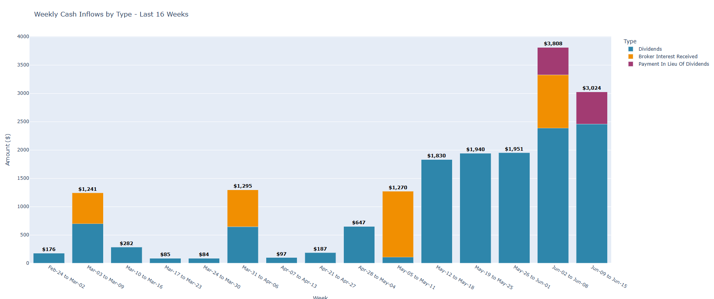

# IBKR Dividend Tracker

A Python application that fetches dividend transaction data from Interactive Brokers (IBKR) using their WebFlex Query API and generates interactive charts showing dividend income over time.

## Features

- 📊 **Interactive Charts**: Monthly and weekly dividend income visualization
- 🔄 **Automated Data Fetching**: Retrieves latest dividend data from IBKR
- 💾 **Local Data Storage**: Saves raw data and filtered results locally
- 🔒 **Secure Configuration**: Environment-based token management

## Prerequisites

- **IBKR Account**: Active Interactive Brokers account
- **Python 3.11+**: With conda or pip package manager
- **WebFlex Access**: IBKR WebFlex Query permissions enabled

## IBKR Setup Instructions

### Step 1: Enable WebFlex Query Access

1. **Log into IBKR Client Portal**: https://www.interactivebrokers.com/portal/
2. **Navigate to Reports**: Go to "Performance & Reports" → "Flex Queries"
3. **Enable WebFlex Service**: 
   - Click "Configure Flex Web Service"
   - Accept the terms and enable the service
   - Note down your **Flex Web Service Token** (you'll need this later)

### Step 2: Create Cash Transaction Query

1. **Create New Query**:
   - Click "Create" → "Activity Flex Query"
   - Name it: `Cash Transactions` (or your preferred name)

2. **Configure Query Sections**:
   - **Cash Report**: ✅ Enable
   - **Date Period**: Set to your preferred range (e.g., "Last 365 Days" or "Year to Date")

3. **Cash Report Configuration**:
   - **Include**: 
     - ✅ Dividends
     - ✅ Other Fees (optional)
     - ✅ Deposits/Withdrawals (optional)
   - **Columns to Include**:
     - ✅ Symbol
     - ✅ Description  
     - ✅ Date/Time
     - ✅ Settle Date
     - ✅ Amount
     - ✅ Currency
     - ✅ Type
     - ✅ Ex-Date
     - ✅ Report Date

4. **Save Query**:
   - Click "Save"
   - Note down the **Query ID** (appears in the query list)

### Step 3: Get Your Configuration Values

After completing the setup, you'll have these required values:

- **Flex Web Service Token**: From Step 1 (long alphanumeric string)
- **Cash Transactions Query ID**: From Step 2 (numeric ID)

## Installation

### 1. Clone Repository
```bash
git clone https://github.com/vagulans/dividend-tracker.git
cd dividend-tracker
```

### 2. Create Environment
```bash
# Using conda (recommended)
conda create -n ibkr python=3.11
conda activate ibkr

# Or using venv
python -m venv ibkr
# Windows:
ibkr\Scripts\activate
# Linux/Mac:
source ibkr/bin/activate
```

### 3. Install Dependencies
```bash
pip install requests pandas python-dotenv plotly
```

### 4. Configure Environment Variables

Create a `.env` file in the project root:

```bash
# Copy the sample file
cp .env.sample .env
```

Edit `.env` with your IBKR credentials:
```env
# IBKR WebFlex Service Token (from IBKR Client Portal)
IBKR_TOKEN=your_flex_web_service_token_here

# Query ID for Cash Transactions (from your Flex Query)
FLEX_QUERY_ID_CASH_TRANSACTIONS=your_query_id_here
```

**Important**: Never commit your `.env` file to version control!

## Usage

### Run the Application
```bash
# Standard run (uses cached data from today if available)
python main.py

# Force fresh data fetch (ignores cache)
python main.py --no-cache
```

### Command Line Options

- **`--no-cache`**: Force fetch fresh data from IBKR, ignoring any cached files from today. Useful when you want the most up-to-date data or if you suspect cached data might be incomplete.

### What It Does

1. **Checks for Today's Data**: Looks for existing raw data files from today (unless `--no-cache` is used)
2. **Fetches New Data**: If no current data exists or cache is bypassed, requests fresh data from IBKR
3. **Processes Dividends**: Filters transactions to show only dividend payments
4. **Generates Reports**:
   - Console summary of dividends by symbol
   - `filtered_dividends.csv` file with detailed records
   - Interactive monthly dividend chart
   - Interactive 16-week dividend chart
5. **Displays Charts**: Opens interactive Plotly charts in your browser

### Sample Output
```
Symbol  Count  Total Dividends
MUC     10           6101.25
QQQY     3           2204.31
YMAG    16           2168.60
```

## Screenshots

### Monthly Dividend Chart
The application generates an interactive monthly view showing dividend income aggregated by month with clean MMM-YY formatting (e.g., "Jul-24", "Aug-24"). Each column displays bold dollar amounts at the top for easy reading.


*Monthly dividend income with dollar amount labels*

### Weekly Dividend Chart (Last 16 Weeks)
A detailed 16-week view showing recent dividend activity with week ranges in MMM-DD to MMM-YY format (e.g., "May-16 to May-25"). Perfect for tracking recent dividend trends and patterns.


*16-week dividend tracking with date ranges*

### Console Output
Clean tabular summary showing dividend counts and totals by stock symbol, plus detailed transaction listing.


*Terminal output showing dividend summary and transaction details*

> **Note**: To add your own screenshots, take screenshots of the charts when they appear in your browser and save them in a `screenshots/` folder in the project root.

## File Structure

```
IBKR/
├── main.py                    # Main application script
├── trades.py                  # Additional trading analysis (optional)
├── .env                       # Your environment variables (not tracked)
├── .env.sample               # Template for environment setup
├── .gitignore                # Git ignore rules
├── README.md                 # This file
├── screenshots/              # Chart screenshots for documentation
│   ├── monthly-dividends.png
│   ├── weekly-dividends.png
│   └── console-output.png
├── raw/                      # Raw data from IBKR (not tracked)
│   └── flex_report_*.csv
└── filtered_dividends.csv    # Processed dividend data (not tracked)
```

## Security Notes

- 🔐 **Token Security**: Your IBKR token provides access to account data - keep it secure
- 🚫 **Never Share**: Don't commit `.env` files or share tokens publicly
- 📁 **Local Data**: Raw data and filtered results stay on your machine
- 🔄 **Token Rotation**: Consider rotating your WebFlex token periodically

## Troubleshooting

### Common Issues

**"No Type column found"**
- Ensure your Flex Query includes cash transactions with the "Type" field
- Verify the query is saved and active in IBKR

**"Invalid token" errors**
- Check your `.env` file has the correct token
- Verify WebFlex service is enabled in IBKR Client Portal
- Try regenerating your token in IBKR

**"No data returned"**
- Confirm your date range includes dividend-paying periods
- Check that your account has dividend transactions in the specified period

**Charts not displaying**
- Ensure you have dividend data in your account
- Try running `pip install plotly` to update plotting library

**Stale or incomplete data**
- Use `python main.py --no-cache` to force fetch fresh data from IBKR
- Check that your Flex Query date range includes recent transactions

### Getting Help

1. **IBKR Support**: For WebFlex setup issues, contact IBKR support
2. **GitHub Issues**: For application bugs or feature requests
3. **Documentation**: Refer to IBKR WebFlex API documentation

## Contributing

Contributions welcome! Please:

1. Fork the repository
2. Create a feature branch
3. Make your changes
4. Test thoroughly
5. Submit a pull request

## License

This project is for personal use. Ensure compliance with IBKR's terms of service when using their API.

---

**Disclaimer**: This tool is for informational purposes only. Always verify dividend data with official IBKR statements and consult with financial professionals for investment decisions. 